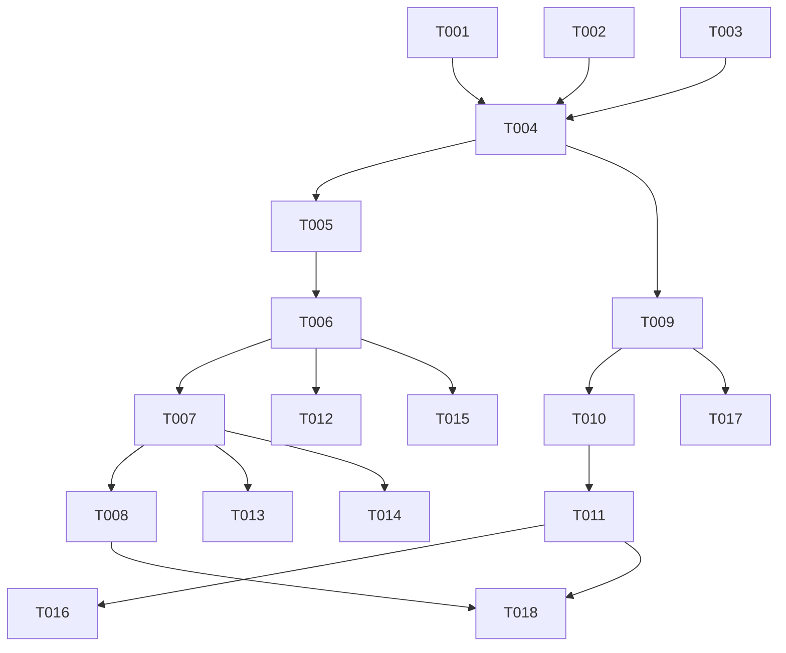

# Comisiones por origen del negocio — Task Breakdown

**Plan:** 001-comisiones-por-origen/plan.md
**Created:** 2026-07-26

---

## Format
`[ID] [Flags] [Story] Description` — `[P]` = paralelizable · `[INFRA]` = infraestructura

---

## Phase 1: Data & Contracts (BLOQUEA todo lo demás)

- **T001** [INFRA] Crear `supabase/migrations/041_invoice_origin_fields.sql`: en `income_invoices` añadir `es_cliente_nuevo boolean not null default false`, `canal_origen text` (check `in ('hacku','hunter')` o null), `meses_facturados integer`. Aditivas, defaults seguros.
- **T002** [P] [INFRA] Crear `supabase/migrations/042_client_hunter_originador.sql`: en `hacku_clientes` añadir `hunter_originador_id uuid references vendedores(id)`, `es_negocio_nuevo_originado boolean not null default false`. Índice en `hunter_originador_id`.
- **T003** [P] [INFRA] Crear `supabase/migrations/043_item_commission_tipo_negocio.sql`: en `invoice_item_commissions` añadir `tipo_negocio text` (`recurrente`|`one_time`), `proyecto_corto_hunter boolean not null default false`, `regla_aplicada text`.
- **T004** [INFRA] Regenerar/editar a mano `src/types/database.types.ts` con las columnas de T001–T003. Depende de T001, T002, T003.

## Phase 2: Core Logic — función pura primero (TDD)

- **T005** [US1] En `src/lib/commission-math.test.ts` escribir tests de `resolveCommissionRate(context)` ANTES de implementar: recurrente nuevo hacku=20, hunter=25; 6+ meses → 30/35; one_time nuevo hacku=10, hunter=15; proyecto corto → +3; NO cliente nuevo → cae a rango por precio (fallback delega en `commissionPercentForPrice`). Depende de T004.
- **T006** [US1] Implementar `resolveCommissionRate(context) => { porcentaje, regla }` en `src/lib/commission-math.ts` con la precedencia de ADR-1 hasta que T005 pase. Depende de T005.

## Phase 3: User Stories

### US1 — Comisión fija por canal para cliente nuevo (P1)
- **T007** [US1] En `src/actions/item-commissions.actions.ts` (`saveItemCommissions` y `recalculateInvoiceCommissions`) usar `resolveCommissionRate` pasando `{ es_cliente_nuevo, canal_origen, meses_facturados, tipo_negocio, proyecto_corto_hunter, precio, moneda }`; poblar `porcentaje` y `regla_aplicada`. Conservar la rama de rangos cuando `es_cliente_nuevo=false`. Nunca confiar en el % del frontend (FR-015). Depende de T006.

### US2 — Bump 6+ meses (P1)
- **T008** [US2] Verificar que `meses_facturados` fluye desde la factura hasta el contexto de T007 y que el bump 30/35 se aplica. (Cubierto por T005/T006; esta tarea es el wiring del campo de factura → cálculo.) Depende de T007.

### US4 — Hunter originador a nivel cliente (P1) — foundational para US3
- **T009** [US4] En la acción de clientes (`src/actions/*clientes*.actions.ts`) añadir set de `hunter_originador_id` + `es_negocio_nuevo_originado` al crear/facturar "cliente nuevo — hunter"; **no sobrescribir** si ya existe (FR-011). Depende de T004.

### US3 — 1% recurrente perpetuo (P1)
- **T010** [US3] En `src/actions/recurring-commissions.actions.ts` cambiar el disparo del 1% de `vendedor.rol='Hunter'` a `cliente.hunter_originador_id` + `es_negocio_nuevo_originado=true`. Beneficiario = Hunter originador. Depende de T009.
- **T011** [US3] Implementar excepción cuenta existente (FR-009): si `es_negocio_nuevo_originado=false`, no generar 1%. Y regla ADR-4/FR-010: si el originador es la misma persona que ya comisiona como KAM/closer ese mes, suprimir la fila del 1%. Depende de T010.

### US5 — One-time con reglas de origen (P2)
- **T012** [P] [US5] Poblar `tipo_negocio` (derivado del plan/ítem: `one-time` vs recurrente) y `proyecto_corto_hunter` al calcular ítems; asegurar ramas 10/15 (+3) en `resolveCommissionRate`. Depende de T006.

## Phase 4: Interface

- **T013** [US1] En `src/components/alegra/alegra-invoice-request-form.tsx`: checkbox "Nueva factura (cliente nuevo)", selector canal (`Traído por hackÜ (20%)` / `Traído por Hunter (25%)`), input `meses_facturados`. Enviar solo flags (FR-015). Validar canal requerido si cliente nuevo. Depende de T001, T007.
- **T014** [P] [US6] En `src/components/comisiones/comisiones-client.tsx` mostrar `regla_aplicada` por comisión (FR-014). Depende de T003, T007.

## Phase 5: Polish & Verify

- **T015** [P] [INFRA] Test de regresión SC-005: set de facturas "cliente existente" produce las mismas comisiones antes/después. Depende de T006, T007.
- **T016** [P] [INFRA] Tests de US3: perpetuidad sigue al originador tras cambio de gestor (SC-003); cuenta existente sin 1% (FR-009); misma-persona no-suma (SC-004/FR-010). Depende de T011.
- **T017** [INFRA] (Opcional) Script backfill `src/app/api/backfill-*/route.ts` para poblar `hunter_originador_id` de clientes de negocio nuevo históricos, service-role, guard `CRON_SECRET`. Depende de T009.
- **T018** [INFRA] `npm run build` + `npm run lint` verdes; verificación manual del flujo cliente nuevo → comisión → recurrencia. Depende de todo lo P1.

---

## Dependency Graph

## Execution Order
1. **T001, T002, T003** (migraciones, paralelas) → **T004** (tipos)
2. **T005 → T006** (lógica pura TDD) · en paralelo **T009** (originador cliente)
3. **T007 → T008** (motor ítems) · **T010 → T011** (recurrencia 1%)
4. **T012** (one-time P2) · **T013, T014** (UI)
5. **T015, T016** (tests regresión + US3) · **T017** (backfill opc.) → **T018** (verify)
