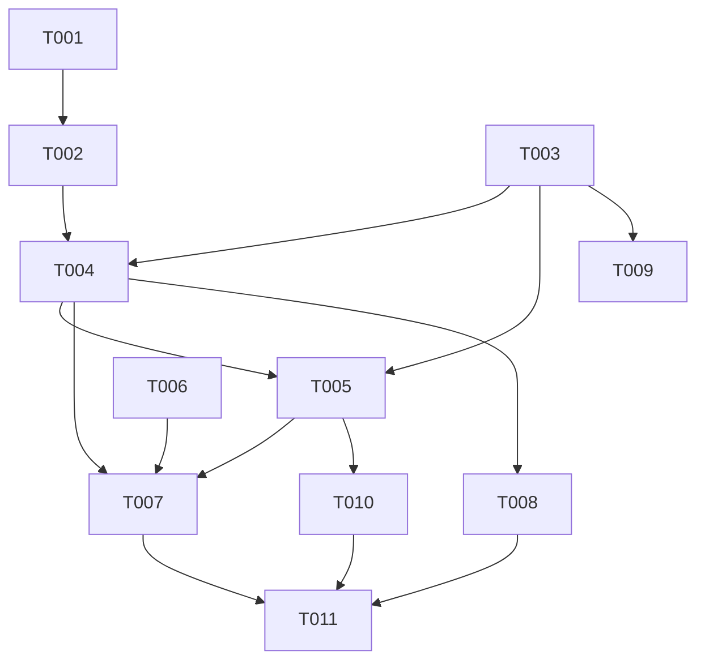

# División de comisiones — Task Breakdown

**Plan:** 003-division-comisiones-reparto/plan.md
**Created:** 2026-07-28

---

## Format
`[ID] [Flags] [Story] Description` — `[P]` = paralelizable; `[Story]` = US1..US4 o INFRA.

---

## Phase 1: Foundation (BLOQUEA todo lo demás)

- T001 [INFRA] Migración `supabase/migrations/049_commission_share_reparto.sql`: `ALTER TABLE invoice_item_commissions ADD COLUMN share_reparto numeric NOT NULL DEFAULT 100;` (idempotente con `IF NOT EXISTS` si aplica).
- T002 [INFRA] Actualizar `src/types/database.types.ts`: añadir `share_reparto` a Row/Insert/Update de `invoice_item_commissions`.
- T003 [US1] En `src/lib/commission-math.ts` implementar función pura `splitItemCommission(comisionLocal, comisionUsd, participants: {beneficiario_nombre, rol, share}[])` → array con `{beneficiario_nombre, rol, share, monto_comision_local, monto_comision_usd}`. Regla: monto = comisión × share/100; redondeo a 2 decimales; residuo al último participante (ADR-4). Exportar además un helper `sumaSharesEsCien(participants): boolean`.

## Phase 2: Core Logic (depende de Phase 1)

- T004 [US1] `src/actions/item-commissions.actions.ts` › `calculateItemCommissions`: calcular comisión total del item una sola vez (`baseForCommission × itemPct/100`, local y USD) y repartirla con `splitItemCommission` en vez de aplicar `itemPct` a cada participante. Incluir `share_reparto` en cada resultado. (Corrige `item-commissions.actions.ts:112-117`.)
- T005 [US2][US3] `src/actions/item-commissions.actions.ts` › `saveItemCommissions`: recomputar comisión total del item server-side, **validar que la suma de shares por item = 100%** (rechazar con error si no), repartir con `splitItemCommission`, persistir `share_reparto` + `monto_comision(_usd)` reparteado; mantener `porcentaje` = tasa del item. (Corrige `item-commissions.actions.ts:225-227`.)

## Phase 3: Interface (depende de Phase 2)

- T006 [P] [US2] `commission-participants-editor.tsx`: input de % sigue siendo digitable; ajustar copy para dejar claro que es reparto; "Total comisión" en rojo/aviso si `totalPorcentaje !== 100`.
- T007 [US2] `income-invoice-form.tsx`: en `handleFormSubmit` bloquear con toast si la suma de shares ≠ 100%; asegurar que el preview (`itemCommissionPreview`) usa el reparto de T004 y el total por item es constante.
- T008 [P] [US2] `alegra-invoice-request-form.tsx`: replicar el bloqueo de suma ≠ 100% y el preview reparteado (mismo `calculateItemCommissions`).

## Phase 4: Quality & Backfill

- T009 [P] [INFRA] `src/lib/commission-math.test.ts`: casos 50/50, 70/30, 1 participante (100%), suma ≠ 100% (rechazo), redondeo de centavos, base con `costo_directo`.
- T010 [US4] `src/app/api/backfill-commission-split/route.ts`: backfill idempotente que corrige filas históricas infladas (self-guard con `CRON_SECRET`); dry-run primero. Verificar Σ montos por item ≤ subtotal×tasa antes de dividir.
- T011 [INFRA] Verificación manual con el caso del screenshot: 1.000.000 COP, tasa 5%, Mateo 50% / Paola 50% → 25.000 + 25.000 = 50.000 COP total (preview y fila guardada). Revisar `comisiones-client.tsx` no muestre montos inflados.

---

## Dependency Graph

## Execution Order
1. T001 → T002, T003 (T003 en paralelo con la migración)
2. T004 → T005
3. T006, T007, T008 (UI; T006/T008 paralelizables)
4. T009 (tests), T010 (backfill)
5. T011 (verificación end-to-end)
